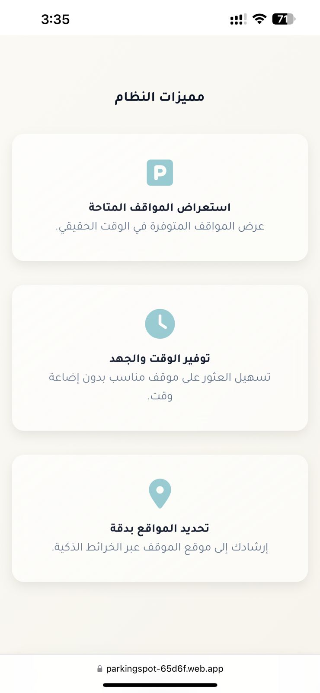
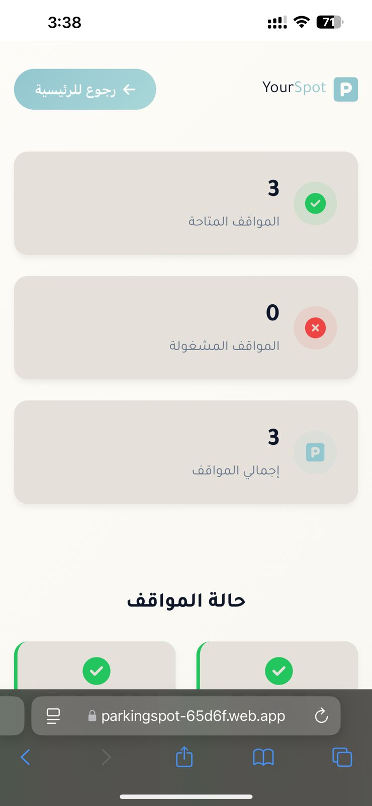
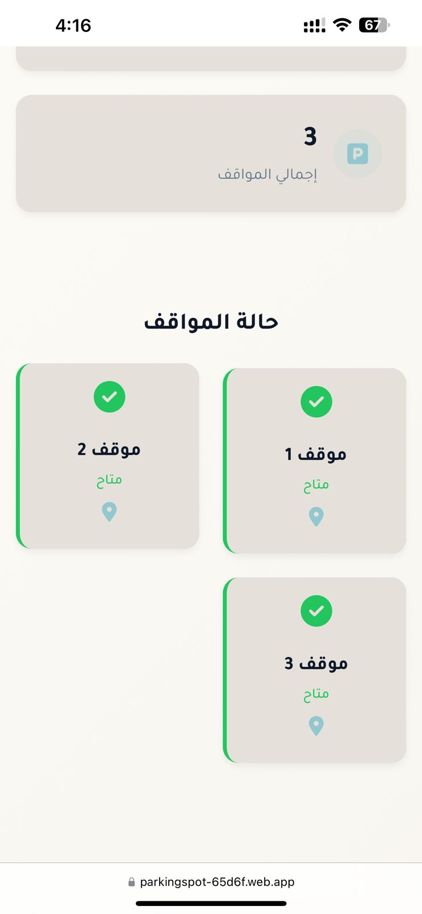

# 🅿️ Smart Parking Management System

A smart system designed to help drivers find available parking spots in real time using sensors and an interactive web interface. This was developed as a university graduation project.

## 🔗 Live Demo

👉 [YouTube](https://youtu.be/hTHtEhBxtrU?si=DhIpAeOW5_0fl-Ib
) - Watch the live demo

---

## 📸 Screenshots
<h3>Home Page</h3>

<h3>Parking Page</h3>

	

<h3>📊 Admin Dashboard (Supervisor View)</h3>

	

---

## ⚙️ Technologies Used

- *Frontend*: React.js + Next.js  
- *IoT Hardware*: Arduino + ESP32-sensor 
- *Backend/API: Firebase   
- *Communication*: HTTP Requests or WebSocket  

---

## 💡 Project Overview

This system performs the following:

1. Sensors placed in each parking spot detect whether the spot is occupied or vacant.
2. Sensor data is sent via ESP32 to a Fierbase cloud-based server.
3. The web application fetches this data and displays available spots .
4. Drivers can quickly find and navigate to available parking spots nearby.

---

⸻

👨‍💻 Developer
	•	Khalid Faisal Alfehaid — Full project development and implementation

 note 🗒: This is a graduation project for the 2024-2025 academic year in the Computer Information Systems major.
